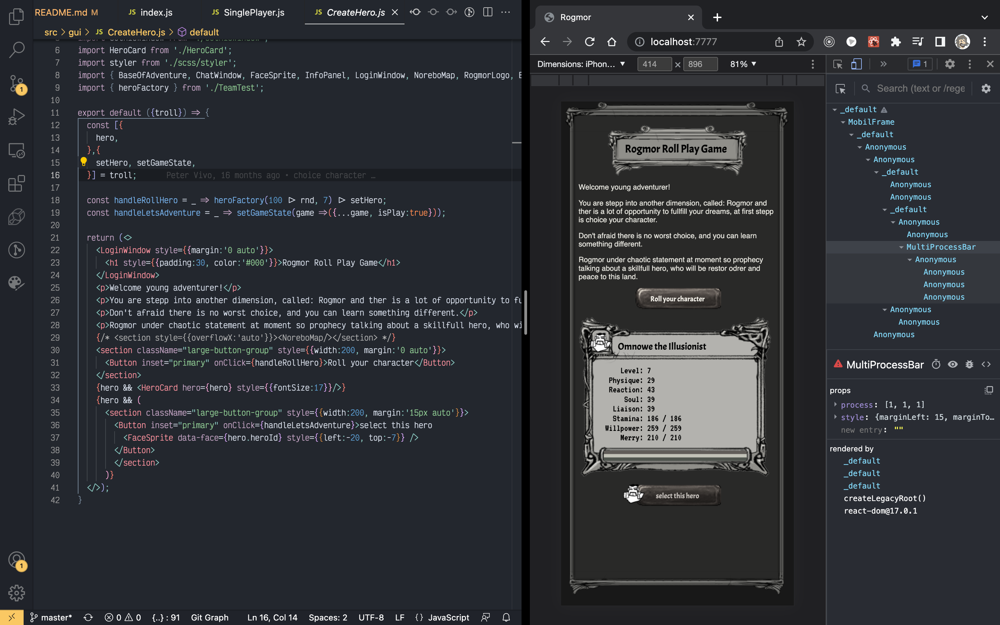
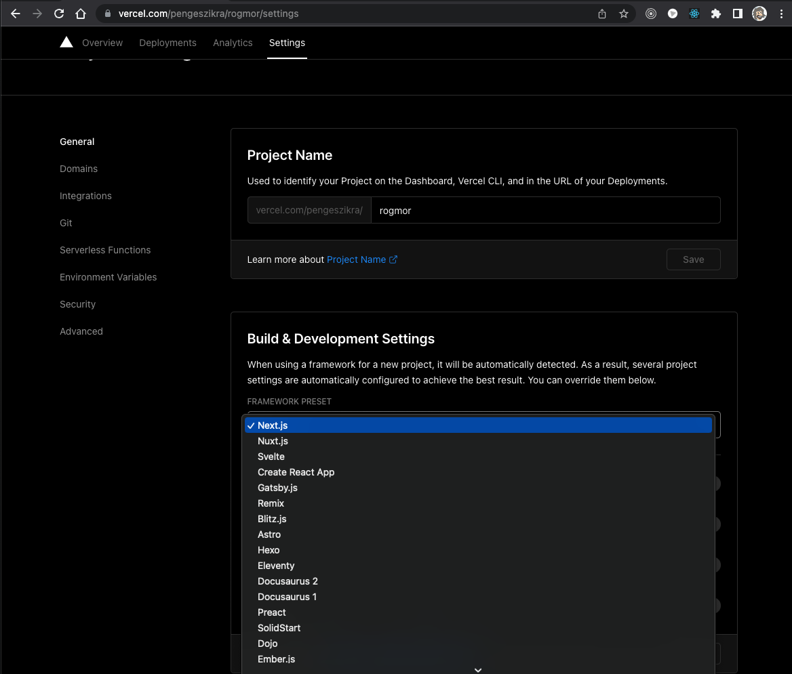

# [Rogmor](https://rogmor.vercel.app/) nextjs implemented RPG
> [at first created on stackblitz](https://stackblitz.com/edit/rogmor)
I founded my old RPG graphic on my desktop, so my plan is create some RPG 
game on react stack, maybe PWA output, easy as possible.

## Next goal:
reworking this project to ```typescript``` and ```nextjs``` builded by ```SWC```

This is the next iteration of my dreams because it focus be realised as nextjs project. Rogmor development started bye a stackblitz application in next step is made of react application until now but now we focus go into the server.


compact view of development

[How to make a MMORPG](https://noobtuts.com/articles/how-to-make-a-mmorpg)

Question is: what is the minimal requirement for usable mobil mmorpg ?

## step of simplify:
  - 2d images
  - basic interface
  - minimal animation

[tile maps](https://developer.mozilla.org/en-US/docs/Games/Techniques/Tilemaps)
[tile image example](https://media.prod.mdn.mozit.cloud/attachments/2015/10/06/11697/40b391b2f58425eb78ddd0660fb8fb2e/tile_atlas.png)

# first saga controlled fight

```js
export function * fightSaga(a, b, fallenOne = p => p) {
  yield `\n`;
  yield `${a.name} - ${a.profession} : ${a.level} : ${a.reaction}`;
  yield 'vs.';
  yield `${b.name} - ${b.profession} : ${b.level} : ${b.reaction}`;
  yield '-'.repeat(20);
  yield `${a.reaction} : ${b.reaction}`;
  const astart = improved(a.reaction) 
  const bstart = improved(b.reaction)
  const [atk, def] = astart > bstart ? [a, b] : [b, a];
  yield `Attacker is: ${atk.name} ${astart} vs ${bstart}`;
  let round = 1;
  while (def.staminaState > 0 && atk.staminaState > 0 && stayInCombat(a) && stayInCombat(b)) {
    let [striker, target] = round % 2 ? [atk, def] : [def, atk];
    let dmg = improved(striker.physique / 2);
    yield `round: ${round} - ${striker.name} - strike ${dmg}`;
    round ++;
    target.staminaState -= Math.min(dmg, target.staminaState);
    yield `${target.name} ${target.stamina}/${target.staminaState}`;
  }
  yield `${atk.staminaState <= 0 ? atk.name : '' } knocked out`;
  yield `${def.staminaState <= 0 ? def.name : '' } knocked out`;
  if (a.staminaState <= 0) 
    {fallenOne(a);}
  else if (b.staminaState <= 0) 
    {fallenOne(b)}
  else 
    {fallenOne(null)};
}
```

# RPG

### character attributes

    > `body` : It is physic of character including strength.

    > `reaction` : It is the reaction capability including first thinking and the reflex.

    > `soul` : Spiritual harmony, logical thinking and wisdom.

    > `presence` : This is the character social and communication.

    > `stamina` : This is the stamina and Longevity. if value reduced to 0 then hero unable to do anything.

    > `focus` : Hero  focus. If value reduce to 0 then hero is fall down.

    > `morale` : This is the fossil energy very helpful at communication situation.


This program focus be refact to the nextjs I hope with that step I reach my goal to single typescript MMORPG focus be a reachable goal.

# Mistakes

The following mistakes I made it when I wrote this program the first one are used exports define default solutions so that each component has no name and that is terrible resident and development tool: Component.

```tsx
// ./components/NoNameComponent.tsx

export default () => (
  <pre>
    <p>Component whitout name</p>
    <p>react component devtool isn't handle well this</p>
  </pre>
);

// use

import IGaveAnotherName from './components/NoNameComponent';
```

# Database

The big question is which database is perfect for this application? 

- mongoDB - already selected mongoDB cloud one
- firebase
- [supabase](https://supabase.com/docs/reference/javascript/installing)

# system design with [arrows](https://arrows.app/#/local/id=o8r9F2OklqH_7JgWSXnt)


```
MATCH path0 = (Talk)<--(NPC)-->()<--(Story)<--()<--(Hero)-->(Experience)<--(Story)<--(Skillset),
path1 = (`Level `)-->()-->(Hero)-->(Inventory)-->()-->()-->(Hero)-->(Skillset),
path2 = (NPC)-->()<--(Story)-->(Talk),
path3 = (Login)-->(Play)-->(Hero)-->(`Level `)<--(Experience),
path4 = (Story)-->()-->(Inventory),
path5 = (Login)-->()-->(Play),
path6 = (:instance)-->(Login),
path7 = ()
RETURN path0, path1, path2, path3, path4, path5, path6, path7
```
## Important deployment step of Vercel
I take few hour to solve the automatic vercel deployment from my gith repo.
On Build & Development Settings drop down you can select nextjs instead of try output library set to `.next/`



```tsx
export function * encounterSaga() {
  const {payload:{heroTeam, opponentTeam, area, isAuto}} = yield take(ENCOUNTER_BEGIN);

  const {type} = yield take([LETS_TALK, AMBUSH, CHARGE]);

  if (type === CHARGE) {
    let sequence = speedOrder([
      chargeOrder(heroTeam),
      awarnesOrder(opponentTeam),
    ]);

    while (sequence.length) {
      const [next] = sequence;
      const nextMove = heroTeam.includes(next) 
        ? yield waitUserInteraction()   // >>  take([STRIKE, SKILL])
        : yield figureOutOppositesMove()
    }


  }

}
```

# Slash
Small script language with tailwind like syntax for simplify skill programming.
Easy compose functionality

```bash
    # simple strong strike with weapon
    target
    body-hit
    power-2

    target-all
    body-hit
    weak-2

    fill-4 # need a four round to refill
    target-2
    soul-hit-4

    fill-3
    target-ally
    soul-heal-2

    fill-2
    target-ally-all
    reaction-shield-4

    instant # this means ready for use instant
    fill-4
    target-random
    soul-hit-percent-5

    fill-6
    body-sacrifice-5
    target-ally-dead
    resurrection
    soul-heal-4
```

# TDD Test Drive Development
Under Slash development, the TDD is a great help. Step by step implement the whole action process,
maybe this code is not the optimum, but looks it is working. And TS also great help to solve this complex process.

Seems it is works fine in reality. This way the whole progress can be followed. And shows some missing feature after the first implementation of `slash` the inner script language.

